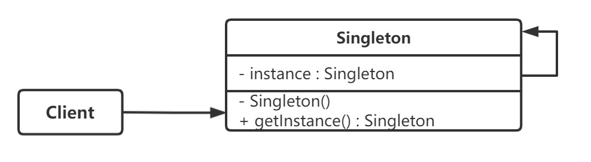
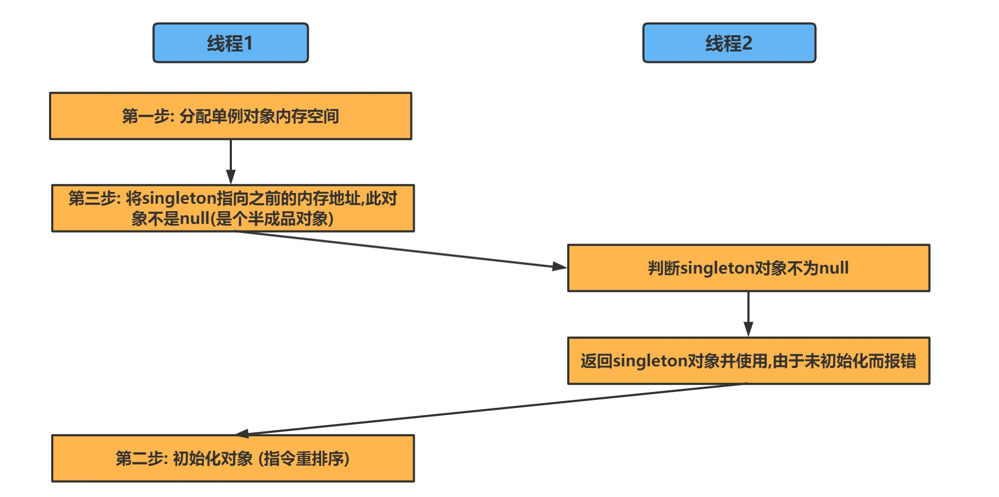

# 单例

## 目录

-   [饿汉](#饿汉)
-   [普通懒汉](#普通懒汉)
-   [聪明懒汉（加锁）](#聪明懒汉加锁)
-   [顶级懒汉（加锁双校验）](#顶级懒汉加锁双校验)
-   [静态内部类](#静态内部类)
-   [反射对单例的破坏](#反射对单例的破坏)
-   [序列化对单例的破坏](#序列化对单例的破坏)
-   [枚举](#枚举)

> 保证一个类只有一个实例对外提供服务



## 饿汉

> 开局就给你创建好，什么都不管
> 线程安全交给JVM，简单无脑，但是**可能会造成空间浪费**

```java
public class Singleton_01 {

    //1. 私有构造方法
    private Singleton_01(){

    }

    //2. 在本类中创建私有静态的全局对象
    private static Singleton_01 instance = new Singleton_01();


    //3. 提供一个全局访问点,供外部获取单例对象
    public static  Singleton_01 getInstance(){

        return instance;
    }

}
```

## 普通懒汉

> 获取实例时进行判断，只有一个判断会造成**线程安全问题**

```java
public class Singleton_02 {

    //1. 私有构造方法
    private Singleton_02(){

    }

    //2. 在本类中创建私有静态的全局对象
    private static Singleton_02 instance;


    //3. 通过判断对象是否被初始化,来选择是否创建对象
    public static  Singleton_02 getInstance(){
  
        if(instance == null){
            // 此处多个线程可能会同时存在
            instance = new Singleton_02();
        }
        return instance;
    }

}
```

## 聪明懒汉（加锁）

> 获取实例方法加锁，防止了线程安全，但是存在**效率问题**

```java
public class Singleton_03 {

    //1. 私有构造方法
    private Singleton_03(){

    }

    //2. 在本类中创建私有静态的全局对象
    private static Singleton_03 instance;


    //3. 通过添加synchronize,保证多线程模式下的单例对象的唯一性
    public static synchronized  Singleton_03 getInstance(){

        if(instance == null){
            instance = new Singleton_03();
        }
        return instance;
    }

}
```

## 顶级懒汉（加锁双校验）

> 加锁双重校验，什么问题都得到了良好解决，但是**编码较复杂**

```java
public class Singleton_04 {

    //使用 volatile保证变量的可见性
    private volatile static Singleton_04 instance = null;

    private Singleton_04(){
    }

    //对外提供静态方法获取对象
    public static Singleton_04 getInstance(){
        //第一次判断,如果instance不为null,不进入抢锁阶段,直接返回实例
        // 此处判断，防止了不必要的枪锁
        if(instance == null){
            // 此时可能会有多个线程在这里阻塞
            synchronized (Singleton_04.class){ 
                //抢到锁之后再次进行判断是否为null
                if(instance == null){ // 此处如果不校验，多个线程各自抢到锁后又会创建对象
                    instance = new Singleton_04();
                }
            }
        }

        return instance;
    }
}
```

-   注意 **volatile**[^注释1]是必要的，如果没有 可能会导致因为对象未被初始化返回，使用时报错

    这里是因为 singleton = new Singleton() ，它并非是一个原子操作，事实上，在 JVM 中上述语句至少做了以下这 3 件事：
    -   第一步是给 singleton 分配内存空间；
    -   第二步开始调用 Singleton 的构造函数等，来初始化 singleton；
    -   第三步，将 singleton 对象指向分配的内存空间（执行完这步 singleton 就不是 null 了）。
    **分配空间→初始化对象→将对象放到****（指向）** ​**空间中去**

    **买房 → 组装家具 → 把家具搬运到房间里去**

    JVM 有时会调换顺序：

    **买房 → 把家具搬运到房间里去 → 组装家具**

    所以增加了 **volatile** 来防止 jvm 自己发挥



## 静态内部类

> **解决了编码复杂，但是防不住反射与序列化对单例的破坏**

```java
public class Singleton_05 {

    private Singleton_05(){}

    private static class SingletonHandler{
        private static Singleton_05 instance = new Singleton_05();
    }

    public static Singleton_05 getInstance(){
        return SingletonHandler.instance;
    }
}

```

## 反射对单例的破坏

-   为什么？

    反射技术过于强大，它可以通过`setAccessible()`来修改构造器，字段，方法的可见性。暴力反射
-   解决方案，但是不优雅

    给空参构造抛出异常，防止通过反射来得到实例
    ```java
    private Singleton(){
            if(SingletonHandler.instance != null){
                throw new RuntimeException("不允许非法访问!");
            }
    }
    ```

## 序列化对单例的破坏

-   为什么？

    序列化读取对象时，其实是创建了一个全新的对象。但是他会检查对象有没有实现 readResolve 方法，如果实现了该方法，就会返回该方法。

    罪魁祸首：` obj = desc.isInstantiable() ? desc.newInstance() : null;`
-   解决方案，但是不优雅

    实现 readResolve() 方法
    ```java
    //只要在Singleton类中定义readResolve就可以解决该问题
    private Object readResolve() {
      return singleton;
    }
    ```

## 枚举

> 代码简洁，同时解决了反射与序列化对单例的破坏

```java
public enum Singleton_06{

    INSTANCE;

    private Object data;

    public Object getData() {
        return data;
    }

    public void setData(Object data) {
        this.data = data;
    }

    public static Singleton_06 getInstance(){

        return INSTANCE;
    }
}
```

-   **枚举为什么可以防止反射破坏**
    1.  枚举只有一个有参构造，并且传参是两个
    2.  枚举无法通过反射来创建，会抛出异常
-   **枚举为什么枚举类可以阻止序列化的破坏**

    对枚举序列化成文件时，其实只对枚举的 name 进行了序列化。

    因为 JVM 保证了枚举的唯一性，所以序列化时也没必要完全序列化。这样，在读取为对象时，读到了 name，再调用枚举的 valueOf() 来找到唯一的实例

[^注释1]: 是保证可见性或者禁止指令重排
