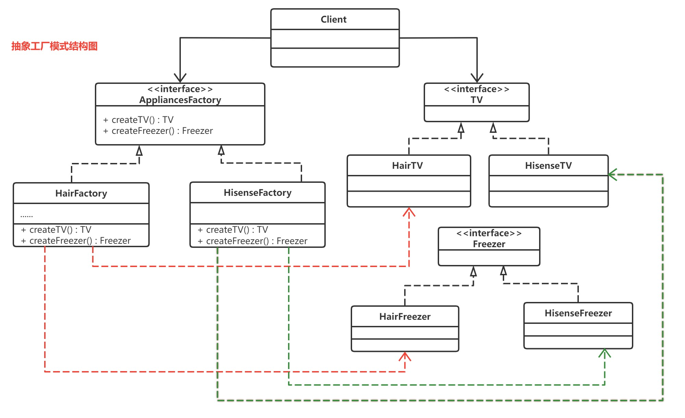

# 抽象工厂模式

> **没有感情，全是抽象**



-   相比与工厂方法，一个工厂可以生产多个产品。（eg：小米工厂：生成手机与耳机.... 苹果工厂：生产手机与耳机.....）
-   有个客户端角色。客户端拥有工厂能生成出的所有抽象（拥有 抽象的耳机，抽象的手机）。同时依赖于抽象的工厂。有参构造需要使用者穿一个具体的工厂过来，客户端以此来生成产品。
-   当新来者 锤子工厂 出现时，应该怎么做？这样做的利弊是什么？
    -   锤子工厂需要实现工厂抽象
    -   锤子手机需要 实现/继承 手机接口
    -   锤子耳机需要 实现/继承 耳机接口
    -   好处显而易见，基本无需改动原来代码，当新的需求出现时，只需要在创建客户端时，传入锤子工厂即可。
    -   坏处也有，代码过多，并且如果工厂的结构、层级 发生变动时，就需要改动大量代码。
-   什么地方用到了？
    -   JDBC 连接

抽象工厂使用情况

```java
public class Client {

    private AbstractTV tv;

    private AbstractFreezer freezer;

    public Client(AppliancesFactory factory) {

        //在客户端看来就是使用抽象工厂来生产家电
        this.tv = factory.createTV();
        this.freezer = factory.createFreezer();
    }

    public AbstractTV getTv() {
        return tv;
    }

    public void setTv(AbstractTV tv) {
        this.tv = tv;
    }

    public AbstractFreezer getFreezer() {
        return freezer;
    }

    public void setFreezer(AbstractFreezer freezer) {
        this.freezer = freezer;
    }

    public static void main(String[] args) {

        Client client = new Client(new HisenseFactory());
        AbstractTV tv = client.getTv();
        System.out.println(tv);

        AbstractFreezer freezer = client.getFreezer();
        System.out.println(freezer);
    }
}
```
