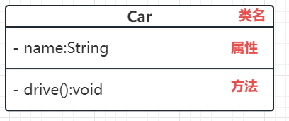

# 设计模式

## 目录

-   [概述](#概述)
    -   [代码质量好坏如何评价](#代码质量好坏如何评价)
    -   [编程方法论](#编程方法论)
    -   [设计模式概述](#设计模式概述)
-   [UML](#UML)
    -   [类图](#类图)
        -   [类](#类)
        -   [接口](#接口)
        -   [类关系](#类关系)
-   [设计原则](#设计原则)
-   [设计模式](#设计模式)
    -   [创建型模式](#创建型模式)
    -   [结构性模式](#结构性模式)

## 概述

### 代码质量好坏如何评价

1.  可读

    任何傻瓜都可以写出计算机看得懂的代码，厉害的人可以写出人类看得懂的代码
2.  可扩展
3.  灵活
4.  可维护

    新需求来了，不需要动原来的代码。在这点上我分不清 灵活性、可扩展性、可维护性，认为他们核心比较相似。
5.  可复用

    没有重复代码，并且下次需求还能用这里面的某些方法
6.  简洁

    最少的代码做最多的事情
7.  可测试

    代码需要单元测试，烂代码连测试都无从下手，更不说测试的结果了

### 编程方法论

1.  面向对象（大思想）

    自动售货机，按按钮出来零食，这就是面向对象原则（消费者不关心过程）
2.  设计原则（心法、内功）
3.  设计模式（心法的实现）（少林、武当。。。）
4.  编程原则（具体实现原则）
5.  重构

    面向对象+设计原则+设计模式+编程原则 融汇贯通

    想要提升代码质量，需要不断去重构代码

### 设计模式概述

-   是什么

    前人成功编码案例的抽象与总结（世上本没有路）（高效维护代码的套路）
-   好处

    高效
-   背景

    “设计模式”这个概念出现在建筑行业，于是被软件行业发现了。四人帮在代码的成功案例中提炼出了设计模式
-   **分类（根据用途分类）**
    -   **创建型**
    -   **结构型**
    -   **行为型**
-   **为什么设计模式解决的都是代码的可扩展性问题？**

## UML

### 类图

-   **为什么出现**

    前期类设计时，缺乏统一标准，大家交流时难以理解对方的设计。所以需要UML类图来迅速表示类结构和类关系。这是一种静态建模方法。
-   访问权限表示

    `+` 表示 public。加号通常表明分数更好，开放性更好。

    `-` 表示private。减号跌入谷底，完全关闭。

    `#`表示protect。井号适中可以给同包下访问，并且可以让子类集成，但是无法让其他包的看到。

    什么都不写表示 default。同包可以访问，但是子类看不到

#### 类

#### 接口

> 接口中所有的方法必须是抽象方法，Java 8 之后 接口中可以使用 default 关键字修饰的非抽象方法。

#### 类关系

-   实现关系（接口实现）

    
-   泛化关系（继承）

    继承听起来就多少沾点血缘管理，理论上比上一个实现关系可靠。

    所以实现关系用虚线，继承关系用实线

    
-   关联关系（无所谓）
    **B的某个方法的返回值是对象A，则B → A。**

    
-   聚合关系

    强关联。小卖铺里有可乐，可乐走了，小卖铺也能活，同时可乐也可以去其他小卖铺工作

    
-   组合关系
    > **燕子没你我怎么活！**
    > 实心菱形表示关系更加紧密！
    -   **组合与聚合如何区分？**

        组合是一种较为紧密的关系，从生命周期上看，**部分和整体是共存亡**的关系。 &#x20;
        聚合则是一种较为松散的关系，部分和整体的生命周期未必一致。

        另一种表现可能是，组合是静态聚集，聚合是动态聚集。
        
-   依赖关系

    全员虚线，表示是一种临时关系。**A的某个方法传入参数是B，则 A 依赖B**

    
-   **箭头的指向怎么说？**

    永远指向高端人士：

    实现类指向接口

    子类指向父类

    可乐指向小卖铺

    岳岳指向燕子

    司机指向他所依赖的车

## 设计原则

> 心法、内功&#x20;

SOLID L  → 稳定的、坚硬的、固体

1.  单一职责原则

    一个人，一座城。一个类，一件事

    Y？如果一个类做的事情太杂，灵活性、可读性、后期维护性都得不到保障。

    单一职责具体要看业务场景，一开始粗粒度满足单一原则，后期需求更多后，就需要对粗粒度的类进行拆分
2.  开闭原则

    开放拓展，关闭修改。

    抽象是户型，实现是各种各样的装修。这就是开闭原则 ，如果不规定户型，后面会杂乱无章，不好管理。

    
3.  里氏替换原则

    官方概念：`如果S是T的子类型，对于S类型的任意对象，如果将他们看作是T类型的对象，则对象的行为也理应与期望的行为一致`
    翻译成人话：有时我们只关心睡觉时，无论是叙利亚还是精装修或是客厅改造成书房的，**无论怎么替换具体实现类，都能满足条件**。这就是里氏替换原则，通常和开闭原则一起出现。
4.  接口隔离原则

    官方概念`客户端不应该被迫依赖于它不使用的方法`

    翻译成人话：禁止捆绑销售。后期需求需要依赖删除接口，就单独写一个，避免影响之前已经实现该接口的类，导致他们多了两个不需要的方法

    
5.  依赖倒置原则

    细节依赖抽象，底层依赖顶层。

    细节具有多变性，而抽象层则相对稳定

    组装计算机时，应该依赖的是内存条，而不是具体的内存条品牌。后期想换个内存条品牌，难道电脑还得重新换吗？

    
6.  迪米特法则

    找中间商节约时间：两个没关系的类，想要沟通，找中间商做聚合

    君子之交淡如水：两个有关系的类，想要沟通，通过最小的接口来实现（只依赖必要的接口）

    

## 设计模式

### 创建型模式

[单例](https://www.wolai.com/uKZxDEGWosojoxzKBP4C6J "单例")

[工厂方法模式](https://www.wolai.com/fowEavD4ki2rLPGBiiL3d6 "工厂方法模式")

[抽象工厂模式](https://www.wolai.com/wDdQWbDWmXYCRjeyjpxKDU "抽象工厂模式")

[建造者模式](https://www.wolai.com/nH3Gd5wMTB9uTtciSURL8g "建造者模式")

[原型设计模式](https://www.wolai.com/s6MkjpYKN93fBNJnv5xY6m "原型设计模式")

### 结构性模式

[代理模式](https://www.wolai.com/hcF4YgyccATyHRqkxNZf8z "代理模式")

[桥接模式](https://www.wolai.com/bUnBhEQSErF2pU8fMQy4B3 "桥接模式")

[装饰器模式](https://www.wolai.com/8PyCqAcg7jU6pQcyxTZY7Y "装饰器模式")

[适配器模式](https://www.wolai.com/azFjchmoAurRzC9c1LYWPK "适配器模式")

[外观模式](https://www.wolai.com/v8XuJrCarSWt7a47viUmYu "外观模式")

[组合模式](https://www.wolai.com/4VHLcZj15RttLQkdWRvg9N "组合模式")
